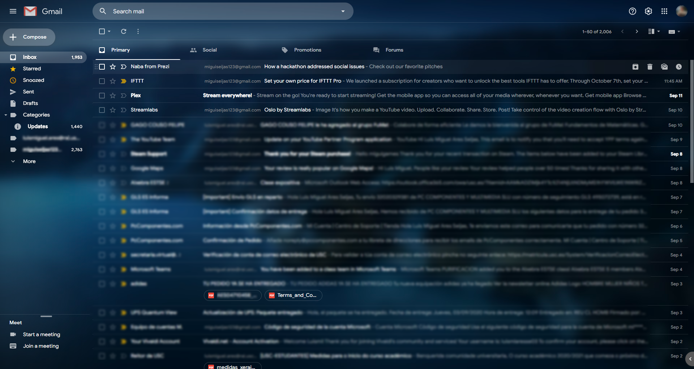

# Gmail Dark Theme Tweaks (Transparent version)
<b>This is my first 'seriously' modified CSS style, I'm not a developer (yet) nor responsible for visual glitches. This was intended for my personal use but I liked my final look, so I'm sharing it here. Credits to Jack Buehner.</b>
 As I don't have any experience with CSS, there may be many strange lines, and the user customizations may not work fine. I encourage anyone interested in this fork to clean the code :P

This style adds a dark theme to additional UI elements on the Gmail webpage. It also makes slight modifications to the appearance of certain elements, including restoring the red compose button.

THIS STYLE REQUIRES THE DARK THEME IN GMAIL
Settings Icon > Themes > Dark > Save

WHEN USING A CUSTOM BACKGROUND, CHANGE THE TEXT MODE TO DARK
Settings Icon > Themes > A > Dark > Save

Currently themed:
- context menus
- loading screen
- This fork has issues with Calendar and Tasks, Keep is fine but not themed.

Modifications:
- red compose button
- translucent search bar
- colorful inbox, starred, and snooze icons in sidebar

<b>Fork modifications:
- made many UI components transparent
- global use of Google Sans font
</b>

## Preview

## Installation

First of all, make sure you have <a href='https://github.com/sahibjotsaggu/Google-Sans-Fonts/archive/master.zip'><b>Google Sans</b></a> installed. It will make the theme look awesome. You won't regret.

Install [Stylus](https://add0n.com/stylus.html) for either [Firefox](https://addons.mozilla.org/en-US/firefox/addon/styl-us/), [Chrome](https://chrome.google.com/webstore/detail/stylus/clngdbkpkpeebahjckkjfobafhncgmne) or [Opera](https://addons.opera.com/en-gb/extensions/details/stylus/) and then install the style:

📦 [Install the usercss](https://github.com/imrickharrison/gmail-dark-modifications/raw/master/gmail-dark.less.user.css)

## Update Notes
v3.0.0
- Initial fork version
