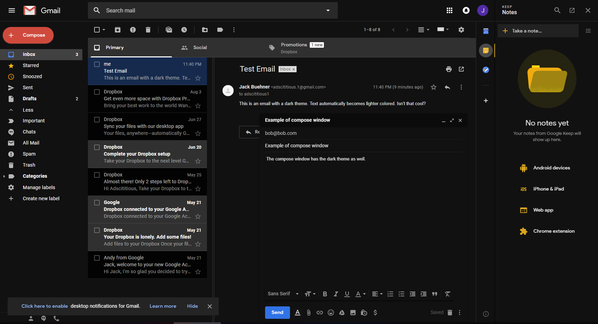

# Gmail Dark Theme Tweaks
This style adds a dark theme to additional UI elements on the Gmail webpage. It also makes slight modifications to the appearance of certain elements, including restoring the red compose button.

There is also support for add-ons that add additional modifications (see bottom of description)

THIS STYLE REQUIRES THE DARK THEME IN GMAIL
Settings Icon > Themes > Dark > Save

WHEN USING A CUSTOM BACKGROUND, CHANGE THE TEXT MODE TO DARK
Settings Icon > Themes > A > Dark > Save

Currently themed:
- context menus
- Google Calendar
- Google Tasks
- Google Keep
- loading screen

Modifications:
- red compose button
- translucent search bar
- colorful inbox, starred, and snooze icons in sidebar

Do you have issues or suggestions? Submit an issue on the [issues tab](https://github.com/jackbuehner/gmail-dark-modifications/issues)

Add-ons: 
[Square Compose Button - Gmail 2018](https://userstyles.org/styles/159108) 
[ADD-ON | Replace archive with done-Gmail Dark 2018](https://userstyles.org/styles/160365)
## Preview

## Installation

Install [Stylus](https://add0n.com/stylus.html) for either [Firefox](https://addons.mozilla.org/en-US/firefox/addon/styl-us/), [Chrome](https://chrome.google.com/webstore/detail/stylus/clngdbkpkpeebahjckkjfobafhncgmne) or [Opera](https://addons.opera.com/en-gb/extensions/details/stylus/) and then install the style using one of these methods:

📦 [Install the usercss](https://github.com/jackbuehner/gmail-dark-modifications/raw/master/gmail-dark.less.user.css), which supports full customization and automatic updates. 
📦 [Install from userstyles.org](https://userstyles.org/styles/159026) with no customization or automatic updates. 
📦 [Install manually from GitHub](https://github.com/jackbuehner/gmail-dark-modifications/raw/master/gmail-dark.css) with no customization or automatic updates, but useful for development. The style is in Mozilla format. 

If you would like to contribute to this repository, please...

1. Fork this repository
1. Make your changes
1. Create a pull request

## Update Notes
v2.3.1
- fix search box (again x3)
- make email message details dropdown arrow visible

v2.3.0
- theme un-styled context menus
- context menus now match the border radius of buttons
- make new context menu icons light
- add dark background for Google Tasks date separators
- fix search box (again)
- make Google Tasks new task box dark when focused
- fix account switcher background and border colors
- fix missing background on Google Calendar calendar selection screen
- fix invisible edit button for tasks in Google Tasks
- block white flash behind compose button

v2.2.4
- fix app drawer and account switcher ([#6](https://github.com/jackbuehner/gmail-dark-modifications/issues/6))

v2.2.3
- fix search box text color ([#5](https://github.com/jackbuehner/gmail-dark-modifications/issues/5))

v2.2.2
- fix inverted Gmail logo
- fix invisible search box

v2.2.1
- newsletters and other email types that were previously not styled are now dark
- primary tab, inbox icon, and label context menu now follow the accent color
- quick fix for search/filter creation
- style new Google Keep search bar

v2.1.0
- NEW: choose between light blue, your accent color, or white (default) for unread message text [UserCSS only]

v2.0.0
- most colors and border radii are now customizable [UserCSS only]
- hover effect for email list
- fix addons headers
- dark style for Google Calendar agenda view
- email text is now slightly darker to accomidate for white backgrounds
- top inbox tabs now have colors
- all know modals are now dark styles
- labels context menu now themed properly
- fixed context menus in Google Tasks and Google Calendar
- add dark style for calendar menus in Google Tasks, Google Keep, and Google Calendar
- inbox icon is now red to metch the rest of Gmail
- inline compose is now styled dark
- scroll bar does not show in message list if the message list is not longer than the page
- popout email toolbar is now themed
- fixed various icons not visible
- fixed account dropdown/switcher
- fixed Google app drawer

v1.9
- inline compose box dark theme

v1.8.2
- compose email dark theme
- email view dark theme
- fixed search bar (again)
- additional style refinements and fixes

v1.7.4
- Google Calendar, Tasks: new user screen dark theme
- Google Keep: no notes screen dark theme
- context menu icons are now white
- context menu headers are now themed
- selected context menu items do not turn black
- Google app drawer is dark again
- Account switcher is themed again
- Google notifications are themed again

v1.7.3
- Google Calendar: select calendars UI dark theme

v1.8-BETA (instructions to enable beta features available at Stylish extension > Manage all styles > Gmail Dark Theme Tweaks)
- dark email background with white text

v1.7.2
- fixed about menu for add-ons background color
- fixed some icons not loading in Chrome (switched from http to https)

v.1.7.1
- fixed more apps button color in Google app drawer

v1.7
- themed app drawer
- themed account switcher

v1.6.1
- more labels dropdown is now transparent

v1.6
- themed Google Calendar plugin dark

v1.5.4
- fixed search bar broken by Gmail update
- fixed Google Tasks broken by Gmail update

v.1.5.3
- themed Gmail theme selector dark

v.1.5.2
- themed display density dialogue dark

v1.4
- fixed google keep and google tasks theme for when multiple google accounts are plugged in
- fixed 'completed' dropdown not themed in google keep plugin
- fixed text color on selected option in context menus

v1.3
- themed google keep plugin dark

v.1.1
- themed google keep plugin dark
- fixed sidebar for non-black background
- removed rounded compose button
